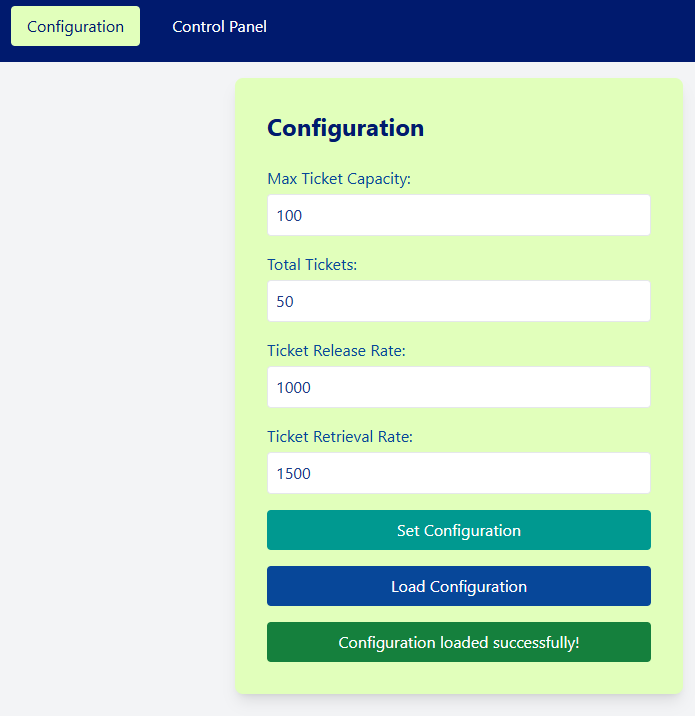
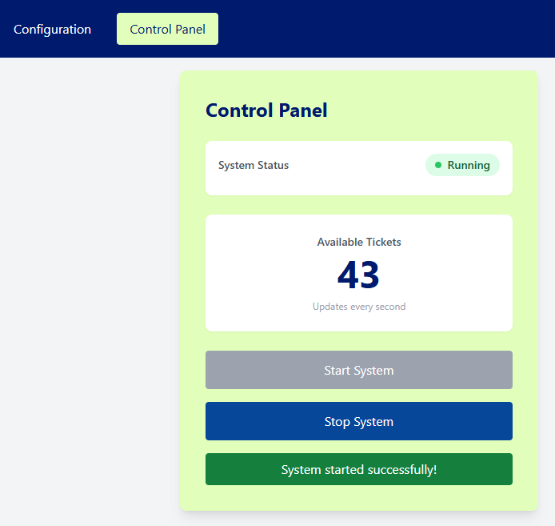

# Event Ticketing System

A real-time event ticket management application demonstrating Object-Oriented Programming (OOP) principles and the Producer-Consumer pattern. The system simulates a dynamic environment where tickets are concurrently released by vendors and purchased by customers, ensuring data integrity and thread safety.

## 🌐 Live Demo

- **WEB UI**: [https://event-ticketing-webapp.azurewebsites.net/](https://event-ticketing-webapp.azurewebsites.net/)

## 📸 Screenshots

### Configuration Panel



The Configuration panel allows you to set up the ticketing system parameters including maximum capacity, total tickets, and release/retrieval rates.

### Control Panel



The Control Panel displays real-time system status, available ticket count, and provides controls to start/stop the ticketing system.

## 🛠️ Technologies Used

### Backend

- **Java 17** - Core programming language
- **Spring Boot 3.4.0** - Application framework
  - Spring Web - RESTful API development
  - Spring Boot DevTools - Development utilities
- **Maven** - Build automation and dependency management
- **Lombok** - Boilerplate code reduction
- **Gson 2.11.0** - JSON serialization/deserialization
- **Guava 33.2.1** - Google's core libraries for Java

### Frontend

- **React 18.3.1** - UI library
- **TypeScript 5.6.2** - Type-safe JavaScript
- **Vite 6.0.1** - Build tool and development server
- **Tailwind CSS 3.4.16** - Utility-first CSS framework
- **ESLint** - Code linting and quality
- **PostCSS & Autoprefixer** - CSS processing

### Cloud Infrastructure (Azure)

- **Azure App Service** - Hosting platform for both frontend and backend
  - **Backend**: Linux-based App Service with Java 17 runtime
  - **Frontend**: Linux-based App Service with Node.js 20 LTS runtime
- **Azure CLI** - Deployment and management
- **Azure Resource Groups** - Resource organization
- **Azure App Service Plans** - Compute resources (Basic B1 tier)

### Development Tools

- **Git** - Version control
- **npm** - Frontend package management
- **Maven Wrapper** - Consistent Maven builds

## 🏗️ Architecture

The application follows a **client-server architecture** with clear separation of concerns:

```
┌─────────────────────────────────────────────────────────────┐
│                     Azure Cloud Platform                     │
│  ┌────────────────────────────┐  ┌──────────────────────┐  │
│  │  Frontend (React + Vite)   │  │  Backend (Spring)    │  │
│  │  Node.js 20 App Service    │◄─┤  Java 17 App Service │  │
│  │  Static File Serving       │  │  RESTful API         │  │
│  └────────────────────────────┘  └──────────────────────┘  │
│         Southeast Asia Region                               │
└─────────────────────────────────────────────────────────────┘
```

### Key Design Patterns

- **Producer-Consumer Pattern** - Ticket release and retrieval
- **RESTful API** - Backend communication
- **Component-Based UI** - React architecture
- **Configuration Management** - Persistent settings via JSON

## 🚀 Features

- ✅ **Real-time Ticket Management** - Concurrent ticket operations
- ✅ **Thread-Safe Operations** - Synchronized ticket pool access
- ✅ **Configurable Parameters** - Customizable capacity and rates
- ✅ **Persistent Configuration** - Save and load settings
- ✅ **Live Status Updates** - Real-time system monitoring
- ✅ **Responsive UI** - Works on desktop and mobile
- ✅ **Cloud Deployment** - Hosted on Azure App Service
- ✅ **CORS-Enabled** - Secure cross-origin communication

## 📋 Prerequisites

### For Local Development

- **Java Development Kit (JDK)**: Version 17 or higher
- **Node.js**: Version 16 or higher
- **Maven**: 3.6+ (or use included Maven Wrapper)
- **npm**: 7+ (comes with Node.js)

### For Azure Deployment

- **Azure CLI**: Version 2.81.0 or higher
- **Azure Subscription**: Active subscription with permissions to create resources

## 🔧 Local Development Setup

### Backend Setup

1. Navigate to the backend directory:

   ```bash
   cd event-ticketing-system-backend
   ```

2. Build the project:

   ```bash
   ./mvnw clean install
   ```

3. Run the application:
   ```bash
   ./mvnw spring-boot:run
   ```

The backend will start on [http://localhost:8080](http://localhost:8080).

### Frontend Setup

1. Navigate to the frontend directory:

   ```bash
   cd event-ticketing-system-frontend
   ```

2. Install dependencies:

   ```bash
   npm install
   ```

3. Run the development server:
   ```bash
   npm run dev
   ```

The frontend will be available at [http://localhost:5173](http://localhost:5173).

## ☁️ Azure Deployment

This application is deployed on **Azure App Service** using the **Azure CLI**. The deployment process includes:

### Deployment Architecture

- **Resource Group**: `event-ticketing-rg` (Southeast Asia region)
- **App Service Plan**: `event-ticketing-plan` (Linux, Basic B1 tier)
- **Backend App**: Java 17 runtime with JAR deployment
- **Frontend App**: Node.js 20 LTS with static file serving via `npx serve`

### Key Deployment Steps

1. **Login to Azure**:

   ```bash
   az login
   ```

2. **Create Resource Group**:

   ```bash
   az group create --name event-ticketing-rg --location southeastasia
   ```

3. **Create App Service Plan**:

   ```bash
   az appservice plan create \
     --name event-ticketing-plan \
     --resource-group event-ticketing-rg \
     --location southeastasia \
     --sku B1 \
     --is-linux
   ```

4. **Deploy Backend**:

   ```bash
   cd event-ticketing-system-backend
   ./mvnw clean package -DskipTests
   az webapp create \
     --resource-group event-ticketing-rg \
     --plan event-ticketing-plan \
     --name event-ticketing-api \
     --runtime "JAVA:17-java17"
   az webapp deploy \
     --resource-group event-ticketing-rg \
     --name event-ticketing-api \
     --src-path target/ticketing_system-0.0.1-SNAPSHOT.jar \
     --type jar
   ```

5. **Deploy Frontend**:
   ```bash
   cd ../event-ticketing-system-frontend
   npm install
   npm run build
   az webapp create \
     --resource-group event-ticketing-rg \
     --plan event-ticketing-plan \
     --name event-ticketing-webapp \
     --runtime "NODE:20-lts"
   az webapp config set \
     --resource-group event-ticketing-rg \
     --name event-ticketing-webapp \
     --startup-file "npx serve -s /home/site/wwwroot -l 8080"
   az webapp deploy \
     --resource-group event-ticketing-rg \
     --name event-ticketing-webapp \
     --src-path frontend.zip \
     --type zip
   ```

### CORS Configuration

The backend is configured to accept requests from the frontend domain:

```java
.allowedOrigins("https://event-ticketing-webapp.azurewebsites.net")
```

## 📖 Usage

### Configuration

1. Access the web interface at the deployed URL or localhost
2. Click on the **Configuration** tab
3. Enter the desired values:
   - **Max Ticket Capacity**: Maximum tickets in the pool
   - **Total Tickets**: Initial number of tickets
   - **Ticket Release Rate**: Vendor release interval (ms)
   - **Ticket Retrieval Rate**: Customer purchase interval (ms)
4. Click **Set Configuration** to apply settings
5. Optionally, click **Load Configuration** to retrieve saved settings

### Control Panel

1. Navigate to the **Control Panel** tab
2. View the current system status and available tickets
3. Click **Start System** to begin ticket operations
4. Click **Stop System** to halt the process

## 🔐 Security Features

- **CORS Protection** - Configured allowed origins
- **HTTPS Enforcement** - Secure communication
- **Input Validation** - Server-side validation
- **Thread Safety** - Synchronized operations

## 📊 System Requirements

### Production (Azure)

- **Backend**: 1 GB RAM, 1 vCPU (Basic B1)
- **Frontend**: 1 GB RAM, 1 vCPU (Basic B1)
- **Storage**: ~100 MB for application files

### Development

- **RAM**: 4 GB minimum, 8 GB recommended
- **Storage**: 500 MB for dependencies and build artifacts
- **Network**: Internet connection for package downloads

## 🧪 Testing

Run backend tests:

```bash
cd event-ticketing-system-backend
./mvnw test
```

Run frontend linting:

```bash
cd event-ticketing-system-frontend
npm run lint
```

## 📝 API Endpoints

### Configuration

- `POST /api/configuration/set` - Set system configuration
- `POST /api/configuration/get` - Get current configuration
- `POST /api/configuration/load` - Load saved configuration

### Control

- `POST /api/control/start` - Start the ticketing system
- `POST /api/control/stop` - Stop the ticketing system
- `GET /api/control/status` - Get system status

## 🤝 Contributing

1. Fork the repository
2. Create a feature branch (`git checkout -b feature/AmazingFeature`)
3. Commit your changes (`git commit -m 'Add some AmazingFeature'`)
4. Push to the branch (`git push origin feature/AmazingFeature`)
5. Open a Pull Request

## 📄 License

This project is open source and available under the MIT License.

## 👨‍💻 Author

**Akila Pramod**

## 🙏 Acknowledgments

- Spring Boot team for the excellent framework
- React team for the powerful UI library
- Microsoft Azure for reliable cloud hosting
- Vite team for the blazing-fast build tool
- Tailwind CSS for the utility-first CSS framework

---

**Built with ❤️ using Spring Boot, React, and Azure**
